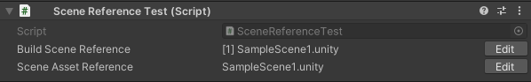
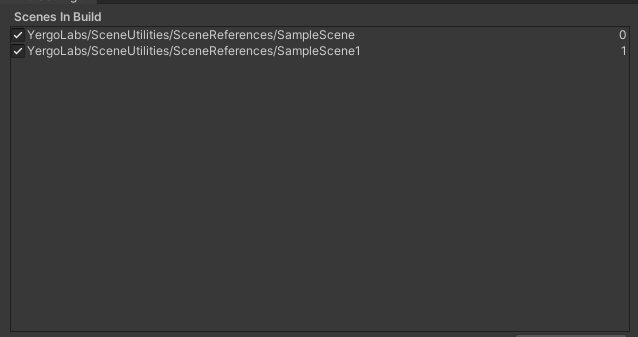
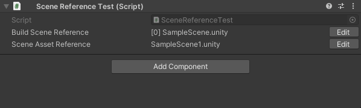
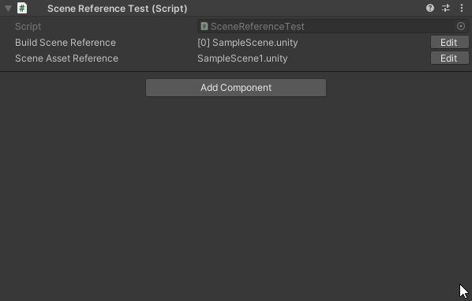

# Scene Utilities

Utilities for scene-related usage. Made in 2022.3.47f1.

## Scene Reference

Structs that contain specific properties are used to reference a scene through the Inspector.

**Referenced scenes are static. They do not update their properties on changes to the scene, folder, or build settings.*

### Build Scene Reference

References the scene through its index in the Build Settings.

### Scene Asset Reference

References through its Asset Path.

